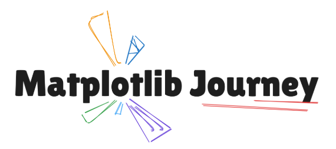

# 🎨 Matplotlib Journey

🌟 **Become the Matplotlib Visualization Expert** 🌟  

An all-in-one, interactive online course designed to make you a matplotlib dataviz expert.

 🧑‍🏫 Taught by:  
- **Yan Holtz**  
- **Joseph Barbier**

## 🚀 **What Will You Learn?**

The course is organized into **6 modules** packed with practical content:

1. **🔰 Matplotlib Basics**: Master the fundamentals.  
2. **✨ Beyond the Defaults**: Advanced customization of charts.  
3. **🖊️ Annotations**: Add visual context to your charts.  
4. **🛠️ Custom Layouts**: Design charts with multiple axes and advanced layouts.  
5. **🗺️ Maps**: Explore the world of geospatial charts.  
6. **🎨 Non-conventional Graphs**: Experiment with unique chart types.  

Wrap up the course with **Your Project** to apply everything you've learned.

🎁 **Bonus**: An extra section with in-depth articles to keep learning beyond the course.

> 🔑 **Note**: 
> * This repository is designed to host the projects from the course [matplotlib-journey.com](https://www.matplotlib-journey.com/). 
> * This repository are developed by [Francisco Alfaro](https://github.com/fralfaro) and [Valeska Canales](https://github.com/vcanalesp).
